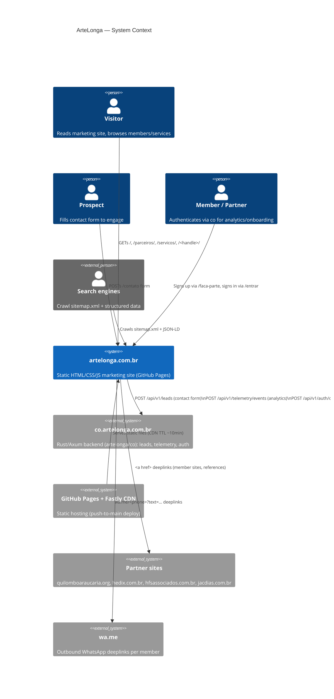
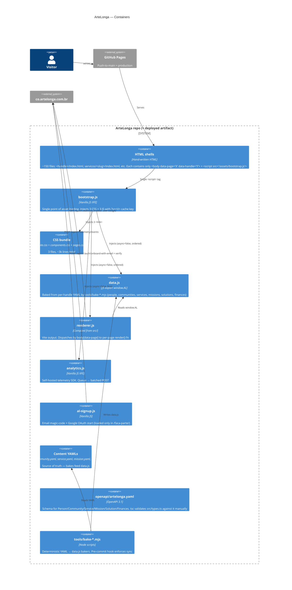
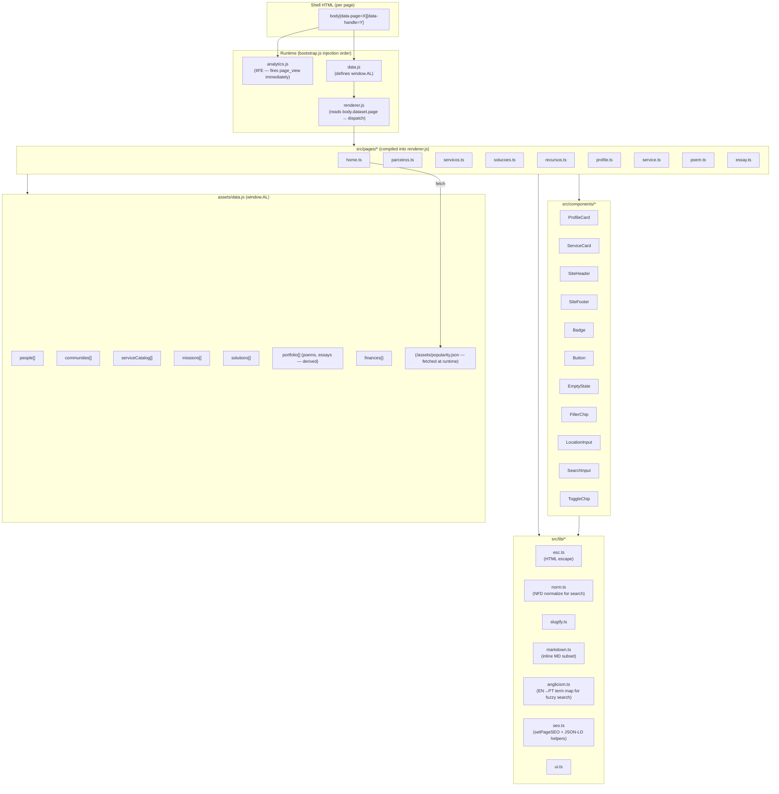
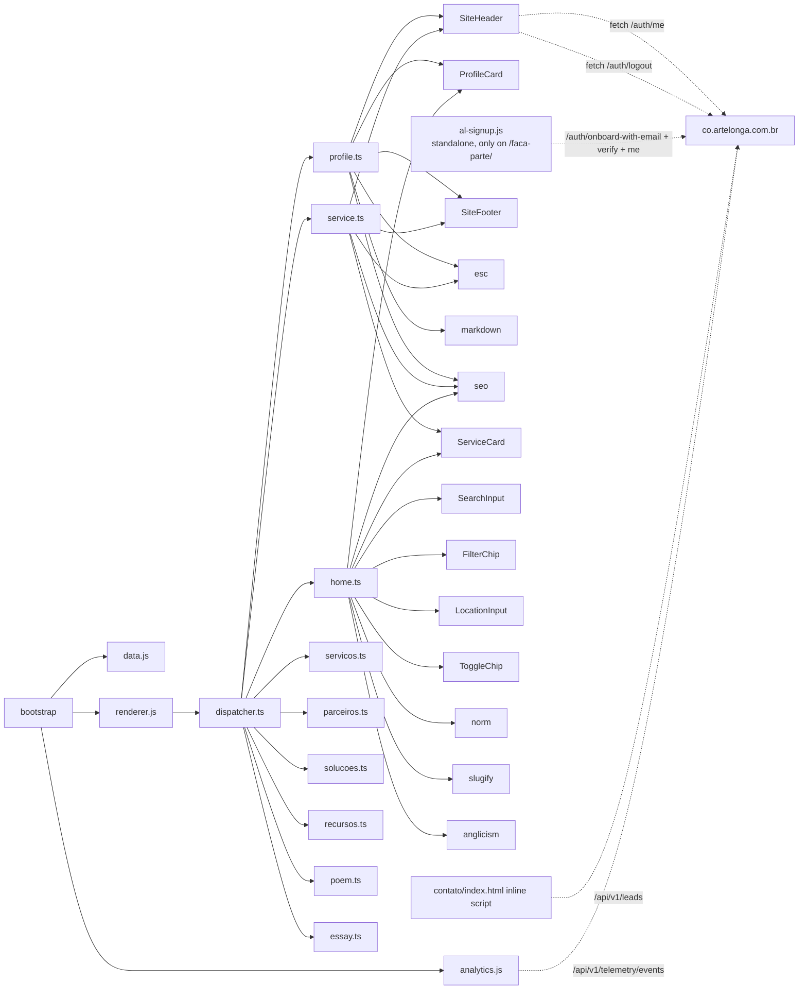

# ArteLonga — As-Is Architecture

Audit date: 2026-05-13. Repo: `artelonga/ArteLonga`. Public site: `artelonga.com.br`.

**Important correction up front:** the prompt assumed Quartz. It is **not** Quartz. ArteLonga is a vanilla-JS static site (no SSG framework on the deploy path), hosted on GitHub Pages, with an opt-in Vite/TS toolchain used only to compile `src/` → `assets/renderer.js`. The render-time runtime is `bootstrap.js` + three CSS files + `data.js` + `renderer.js`, injected by every shell HTML.

---

## C4 — Context



**Notes**

- No iframes anywhere. No third-party widgets. No Google Analytics, no Google Fonts, no Tag Manager. Telemetry is **self-hosted** (sends to `co.artelonga.com.br/api/v1/telemetry/events`).
- The shared cookie `al_vid` is scoped to `.artelonga.com.br` for cross-subdomain identity threading between this site and `co.artelonga.com.br`.
- "Marketing events" in the prompt does not exist as an endpoint here — the closest equivalents are `/api/v1/leads` (contact form), `/api/v1/telemetry/events` (every page + interaction), and `/api/v1/auth/onboard-with-email` (`AL-50` signup flow). No dedicated `marketing_events` route is called.

---

## C4 — Containers



**Container observations**

- Build path: `vite build --config vite.renderer.config.ts` produces `assets/renderer.js`. `vite build` (default config) produces the `/design/` showcase bundle (`dist/showcase.js`). Neither is on the production hot path — both outputs are committed.
- "Deploy" = `git push origin main`. GitHub Pages republishes in ~1min, Fastly TTL is ~10min, and `V` in `bootstrap.js` invalidates versioned assets immediately.
- `contato/index.html` is the only page with **inlined critical CSS** (~250 lines) to prevent CLS from the async bootstrap injection — leaks duplicate styling from `pages.css` to avoid a layout shift on first paint.

---

## C4 — Components (renderer + content)



### Page → data dependency matrix

| Page (data-page) | Reads from `window.AL` | Outbound network |
|---|---|---|
| `home` | `people`, `communities`, `solutions`, `services` | `GET /assets/popularity.json` |
| `parceiros` | `people`, `communities` | — |
| `servicos` | `serviceCatalog`, `people` | — |
| `solucoes` | `solutions` | — |
| `recursos` | `serviceCatalog`, `finances` | — |
| `profile` | `AL.get(handle)`, `people`, `communities`, `services` | — |
| `service` | `serviceCatalog`, `people` | — |
| `poem` | `portfolio[kind=poem]` | — |
| `essay` | `portfolio[kind=essay]` | — |

All pages also: (1) inject `SiteHeader` (which calls `GET /api/v1/auth/me` on `co.artelonga.com.br` for the user badge), (2) inject `SiteFooter`, (3) fire `analytics.js` page_view automatically.

### Content organization (by owner, not by feature)

```
<handle>/                  # one folder per member/community/solution/business
├── profile.yaml           # OR community.yaml OR solution.yaml — source of truth
├── index.html             # shell, renders 'profile' page
├── *.jpg / *.png / *.ogg  # member assets
└── <sub>/index.html       # optional sub-route (e.g. yuri/maes/index.html for a poem)

servicos/<slug>/index.html     # service shells (50 entries)
solucoes/<slug>/index.html     # universe/solution shells (~10)
missoes/<slug>/index.html      # mission shells (~5)
jardim/                        # editorial knowledge garden (currently empty dir)
relatos/, eventos/             # mostly empty placeholders

contato/index.html             # contact form — self-contained, inlined CSS
faca-parte/index.html          # AL-50 signup form
entrar/index.html              # login
sobre/, parceiros/, recursos/, legal/, design/   # standalone pages
```

The folder layout is **owner-first** (`yuri/`, `quilomboaraucaria/`, etc.) rather than feature-first (`pages/`, `posts/`). This is a deliberate consequence of AL-1 (LGPD: data per owner) and L-009. There is no `posts/` or `pages/` directory.

### Component / page dependency graph (custom JS)



### TypeScript footprint

| Area | Files | LOC (approx) |
|---|---|---|
| `src/pages/` | 9 | medium |
| `src/components/` | 11 | small-medium |
| `src/lib/` | 7 | small |
| `src/types.ts` | 1 | mirrors openapi |
| `src/dispatcher.ts` | 1 | 38 lines |
| `src/showcase.ts` | 1 | (design palette only) |

All TS is `strict` (per `tsconfig.json`). Types in `src/types.ts` are hand-mirrored from `openapi/artelonga.yaml` — there is **no codegen**.

### Vanilla JS (un-typed, runtime-critical) footprint

| File | Lines | Role |
|---|---|---|
| `assets/bootstrap.js` | 35 | Asset injector |
| `assets/analytics.js` | 471 | Self-hosted telemetry + A/B framework |
| `assets/al-signup.js` | 117 | Magic-code email signup |
| `assets/data.js` | 3372 | Baked data (mostly auto-generated, partly hand-edited fields) |
| `assets/renderer.js` | 1875 | Vite output of `src/` (build artifact, committed) |
| `contato/index.html` inline | ~120 (in 484-line file) | Contact form submission |

The fact that `renderer.js` is a **committed build artifact** (3372-line `data.js` + 1875-line `renderer.js`) is a deliberate trade-off: the deploy path is `git push` only — no CI build step. The pre-commit hook (`tools/pre-commit-check.mjs`) is load-bearing here (L-021).

---

## Trust / data-flow boundaries

1. **Visitor browser ↔ GitHub Pages CDN:** anonymous read, no auth.
2. **Browser ↔ `co.artelonga.com.br`:** CORS, `credentials: 'include'` for auth-aware calls (`/auth/me`, `/auth/logout`, signup), `credentials: 'omit'` for fire-and-forget telemetry + leads. The shared `.artelonga.com.br` cookie domain unifies `al_vid` between this site and `co`.
3. **YAML → data.js bake:** runs locally (or in pre-commit hook). No CI baking. Drift caught by hook.
4. **Pre-commit hook:** `tools/pre-commit-check.mjs` snapshots `data.js`, re-bakes, compares. Blocks commit on drift. Documented mitigation for L-021.

---

## Build & deploy summary

| Step | Tool | When | Output |
|---|---|---|---|
| YAML → `data.js` | `tools/bake-*.mjs` (Node, no deps beyond `js-yaml`) | Manual, before commit | `assets/data.js` |
| `src/` → `assets/renderer.js` | `vite build --config vite.renderer.config.ts` | Manual, before commit | `assets/renderer.js` |
| `src/` → `dist/showcase.js` | `vite build` (default config) | Manual | `dist/showcase.js` (only for `/design/`) |
| Validate YAMLs vs OpenAPI | `tools/validate-yaml.mjs` (ajv) | Pre-flight to bake | exit 1 if invalid |
| Typecheck | `tsc --noEmit` | Pre-commit (manual) | — |
| Smoke + a11y | Playwright + axe (9 pages) | CI on PR via `.github/workflows/quality.yml` | — |
| Performance budget | Lighthouse CI (LCP < 2.0s, perf ≥ 90, SEO ≥ 95) | CI on PR | — |
| Deploy | `git push origin main` → GitHub Pages | On merge | Live in ~1min, full CDN propagation in ~10min |
