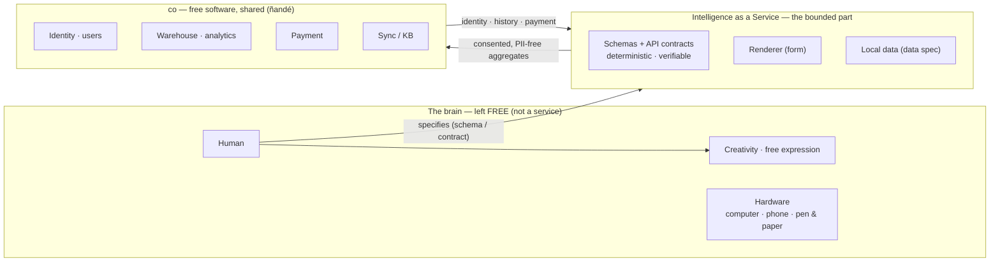
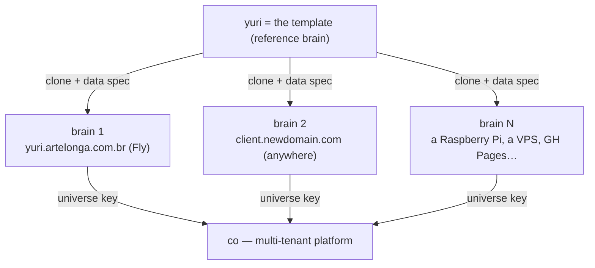
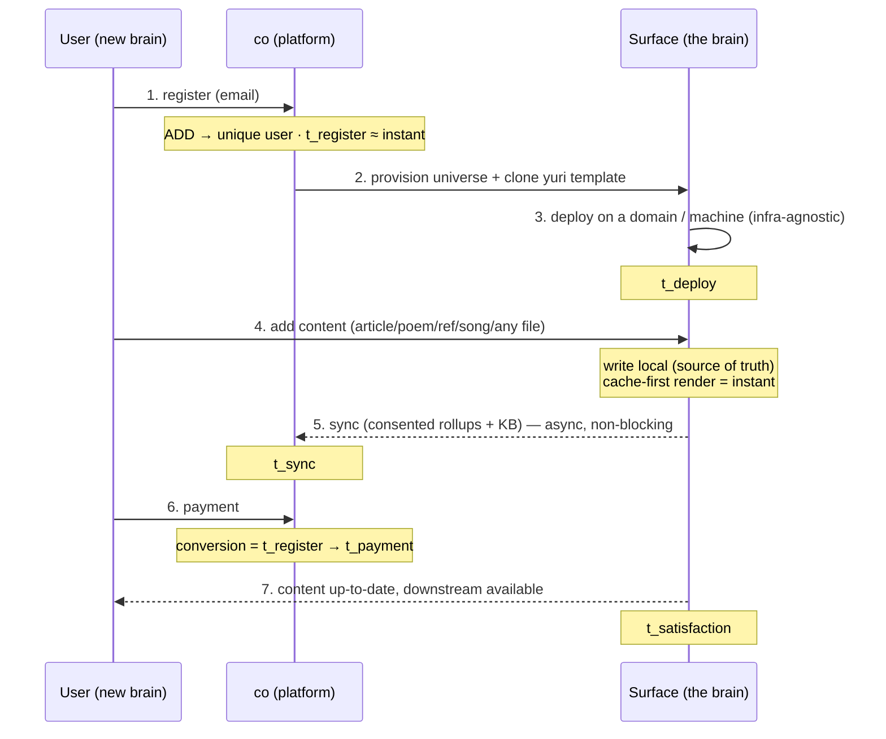
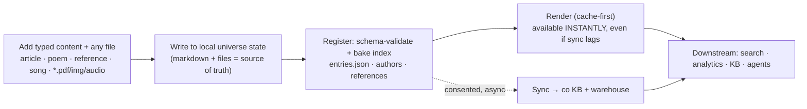
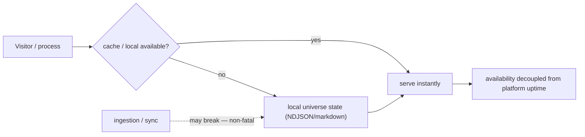

# Intelligence as a Service (IaaS) — the line between what is specified and what is created

**Thesis.** There are two intelligences, and the architecture draws the line between
them honestly. On one side, **bounded intelligence** — everything a *schema* or an
*API contract* can capture: deterministic, functional, verifiable, reproducible.
*That* is what we render **as a service** — the "artificial", machine intelligence.
On the other side, the **brain** — biological intelligence, the human — which we
**deliberately exclude from the deterministic machinery** and leave **free to roam**,
toward creativity and free expression. The service does not commodify the brain; it
absorbs the deterministic labor *so the brain is set free*. (This is yuri's own
tagline made literal: *writing biological and machine intelligence — for the free
expression of being*.)

`yuri` is the reference case. `artelonga` is the **libre network** — *ñandé*, "we,
you included" (Guarani: *ñandé* = we-with-you, not *oré* = we-without-you). **co is
free software** anyone can run. This doc is the empirical essay + the onboarding
playbook + the integration contract — grounded in what the yuri surface already
proves: [`telemetry-surfaces.md`](./telemetry-surfaces.md),
[`analytics-framework.md`](./analytics-framework.md),
[`universe-upgrade.md`](./universe-upgrade.md), `openapi/artelonga.yaml`.

---

## 0. The concept in one picture

**Intelligence as a Service** = the line. The **brain stays free** (creativity, free
expression); the **service is the bounded intelligence that *can* be specified** —
schemas and contracts. **co** (free software, *ñandé* — shared) provides identity,
memory (warehouse), metabolism (payment), and synapses (sync). The contract is the
spec, never an owner.

---

## 1. The case study — what `yuri` proved

| Building block we shipped | What it proves for IaaS |
|---|---|
| **Universe-owned telemetry** + surface (`tools/surfaces-server.mjs`) | A brain owns its raw data; the platform is broadcast-only. **Sovereignty.** |
| **Path → CNAME upgrade** (`universe-upgrade.md`) | A brain promotes from a path on the mothership to its own domain **with no data loss**. **Portability.** |
| **Bidirectional integration** (push rollups + read-back history) | A brain feeds the platform *and* reclaims its own history. **No lock-in.** |
| **Embedded geo** (CC0 + DB-IP, built at deploy) | Full GA-grade insight with **no third-party, no SaaS, no per-call cost**. **Zero SaaS.** |
| **Canonical author identity** (`neuro/authors.js`) | One identity resolves all name variants; content is queryable by entity. **Unified metadata.** |
| **Form / content / data separation** | Rendering, data, and schema are independent layers. **Infra-agnostic.** |

Every one of these is a *property a new brain inherits for free* by cloning the yuri
template.

---

## 2. Why it scales horizontally at zero SaaS cost

Four architectural invariants make a brain a cheap, independent unit:

1. **Three separated layers.** *Form* (renderer, CSS, JS) · *Content* (the brain's
   typed entries + files) · *Data spec* (schemas in `openapi/artelonga.yaml`). A new
   brain supplies **only a data specification, not content infrastructure** — the
   form and the server are the shared template.
2. **Sovereign edge.** Each brain owns its raw state (NDJSON / markdown). The
   platform (co) holds only **consented, PII-free aggregates** (`DailyRollup`). No
   central store of raw → linear cost, no multi-tenant blast radius.
3. **Zero third-party SaaS.** Telemetry is self-hosted; geo is an embedded CC0/DB-IP
   binary compiled at deploy; analytics is co (libre, self-hosted). **No Google Analytics, no geo
   API, no per-seat anything.** Marginal cost of brain N ≈ the cost of a small VM.
4. **Cache-first resilience.** The surface renders from local state; if **ingestion
   or sync breaks, delivery still works** (the apex falls back to a localStorage
   queue, the surface serves its NDJSON, geo degrades to `null`). **Availability is
   decoupled from platform uptime.**

> **Infra freedom (today, literally true).** `yuri.artelonga.com.br` runs on Fly,
> but the surface is a stdlib Node server + static files + an embedded DB. It can run
> on a different domain, a separate machine, GH Pages, or a laptop — **we are not
> locked to any infra choice.** The only contract is the **data spec**, not the host.

---

## 3. The specification a new client provides (data, not content)

A new brain does **not** bring infrastructure. It brings a **data specification** —
which already exists, versioned, in `openapi/artelonga.yaml`:

| Layer | Schema (source of truth) | Who provides |
|---|---|---|
| **Identity** | email → unique user (an *ADD* to co's user DB) | co |
| **Content entries** | typed: `article · poem · reference · song · file` (the garden entry shape, `yuri/_schema.md`) | the brain |
| **References / authors** | `neuro/authors.js` registry + ABNT refs | the brain |
| **Telemetry / analytics** | `TelemetryEvent` (raw, edge) · `DailyRollup` (consented, central) | both |
| **Payment / subscription** | co billing | co |

The brain owns the **content + render**; co **provides** **identity + warehouse + payment +
sync**. Onboarding = wiring those two via the universe key.

---

## 4. Onboarding — the de-facto step set (review checklist)

**The 7 steps to review for every onboarding** (each is a gate with an owner and a
KPI — see §5):

1. **Register** — email → unique user (`ADD` to co user DB). *Owner: co.*
2. **Provision** — create the universe; clone the yuri template (form + server).
   *Owner: co + tooling.*
3. **Deploy** — surface live on any domain/machine; cert + DNS (the
   `universe-upgrade.md` runbook generalizes this). *Owner: ops.*
4. **Ingest** — the brain adds content (any type, any file); it's registered +
   schema-validated. *Owner: brain.*
5. **Sync** — consented aggregates flow to co (warehouse + KB), bidirectionally.
   *Owner: surface ↔ co.*
6. **Convert** — payment. *Owner: co.*
7. **Satisfy** — content up-to-date everywhere, downstream available. *Owner: the
   loop.*

This is the repeatable recipe: **clone yuri, supply the data spec, deploy anywhere,
wire the universe key.**

---

## 5. KPIs & latency — making interactions instant

The network cares about a few **time-to-X** metrics; the architecture is designed to
collapse each toward zero.

| KPI | Definition | Lever that makes it fast |
|---|---|---|
| **t_register** | email → unique user | A single `ADD`. No provisioning blocks identity → **instant**. |
| **t_deploy** | provision → surface live | Clone a *static* template; deploy is image-build + DNS → **minutes, infra-agnostic**. |
| **t_register → t_payment** (conversion) | reg → pay | Payment lives in co next to identity; surface CTA; no SaaS redirect → **reduce hops**. |
| **t_ingest → t_delivered** | add content → available | **Cache-first**: write local (source of truth) renders immediately; sync is async → **delivery is instant even if sync lags**. |
| **t_sync** | local → co KB/warehouse | Idempotent upsert (`DailyRollup`), debounced, feature-detected → **non-blocking, eventually consistent**. |
| **t_satisfaction** | content correct everywhere | Cache-first + eventual sync + graceful degradation → **near-instant, resilient**. |

**The recurring trick (already in the code):** *optimistic local write + cache-first
render + consented async sync + idempotent upsert.* That's exactly the rollup push
(cold-start + debounced, upsert by `(universe, day)`) and the apex dashboard's
feature-detect/localStorage-fallback. It generalizes: **every interaction is served
from the nearest cache and reconciled later** — so the user-perceived latency is the
cache hit, not the round-trip.

---

## 6. Content ingestion — "add anything, it's registered, synced, delivered"

> *"I can add a new article / poem / reference / song or any file and ensure it's
> registered, synced, delivered to the knowledge base, and available downstream."*

Mapped to real mechanics we have:
- **Write** = drop a typed markdown entry (`yuri/_schema.md`) + the file into the
  universe; it's the source of truth.
- **Register** = the bake step (`tools/bake-*.mjs`) schema-validates against
  `openapi/artelonga.yaml` and rebuilds the index (`entries.json`, author registry,
  references) — *content separated from form*.
- **Render** = the surface serves it (cache `max-age=60`); **available before sync
  completes**.
- **Sync** = consented push to co (same pattern as the rollup/feedback broadcast);
  enters the KB + warehouse, keyed by universe.
- **Downstream** = queryable by entity (the author-identity resolution → "where yuri
  is an author"), by analytics, by agents — *available for downstream processes*.

**Resilience guarantee:** if the sync/ingestion path breaks, the brain still
**renders and serves** from local state — ingestion failure ≠ unavailability.

---

## 7. Integrating co + the surfaces — the onboarding contract

```mermaid
flowchart TB
  subgraph EDGE["EDGE — the brains (sovereign, infra-free)"]
    direction LR
    E1["render (form)"]
    E2["local data (NDJSON / markdown + files)"]
    E3["embedded geo (CC0/DB-IP) · zero SaaS"]
  end
  subgraph CENTER["CENTER — co (free software, shared — ñandé)"]
    direction LR
    C1["identity · users (email = ADD)"]
    C2["warehouse · rollups<br/>filterable, multi-tenant (universe key)"]
    C3["payment"]
    C4["KB · sync"]
  end
  EDGE -->|"POST DailyRollup (consented, PII-free)"| CENTER
  CENTER -->|"GET summary?universe= (history + bridge)"| EDGE
  EDGE -->|"feedback (consented)"| CENTER
  CENTER -->|"identity, entitlement, payment state"| EDGE
```

**The contract is the schema, not the implementation** (`analytics-framework.md`).
A brain integrates by:
- adopting the **universe key** (tenancy);
- emitting **consented `DailyRollup`s** (turnkey via the surfaces-server, or an SDK
  for non-Fly brains);
- reading back its **own history** from co's `?universe=` summary;
- authenticating machine-to-machine with a **single token** (`CO_ROLLUP_TOKEN`).

Onboarding a client = **(1)** add the user (email) **(2)** mint a universe key
**(3)** clone + deploy the surface **(4)** set the token **(5)** point the data spec.
Nothing else is bespoke.

---

## 8. Review of the suggestion — does it hold?

| Claim in the brief | Verdict | Evidence |
|---|---|---|
| Telemetry upgrading (path → CNAME) | ✅ shipped + verified live | `universe-upgrade.md`, the bidirectional integration |
| CNAME for horizontal scalability | ✅ each brain = own domain | yuri/hostinger surfaces, infra-agnostic server |
| Conversion (register → payment) | ◑ design + KPI defined | co identity + payment; §5 — needs the co billing wiring |
| Zero SaaS cost | ✅ true today | self-hosted telemetry + CC0/DB-IP geo, no third-party |
| Infra separate / free of infra choices | ✅ true today | stdlib server + static + data spec; runs anywhere |
| DB spec for data (not content) | ✅ exists | `openapi/artelonga.yaml` canonical schemas |
| Render from cache even if ingestion breaks | ✅ shipped | cache-first + localStorage fallback + graceful geo |
| Add any typed content/file → synced/delivered | ◑ partial | bake + render shipped; full KB sync = the next build |

**Net:** the paradigm is real and mostly proven on yuri. The remaining work is
**conversion/payment wiring** and the **content→KB sync** (the rollup pattern
generalizes to it). Both fit the existing seams; neither needs new infra or SaaS.

---

## 9. yuri as the template — the repeatable recipe

To onboard brain N:

1. **`add-user(email)`** → co (instant, an ADD).
2. **`mint-universe(handle)`** → tenancy key.
3. **`clone-surface(yuri)`** → form + stdlib server + data-spec slots.
4. **`deploy(any-host)`** → cert + DNS (`universe-upgrade.md` runbook).
5. **`set CO_ROLLUP_TOKEN` + `CO_HISTORY`** → bidirectional integration on.
6. **`supply data spec`** → the brain fills content; bake registers it.
7. **Review the 7 onboarding gates (§4) against the KPIs (§5).**

`yuri` is not a special case — it's the **de-facto template** for how artelonga scales
to N brains, each sovereign, each on whatever infra is cheapest, each costing ~one
small VM, integrated to one libre platform we all share (ñandé).

---

## References

- [`telemetry-surfaces.md`](./telemetry-surfaces.md) — surfaces, Option C, geo, GA parity.
- [`analytics-framework.md`](./analytics-framework.md) — canonical schema, central filterable API, producers.
- [`universe-upgrade.md`](./universe-upgrade.md) — the path→CNAME runbook (generalizes to onboarding deploy).
- `openapi/artelonga.yaml` — the data spec (the contract a brain supplies).
