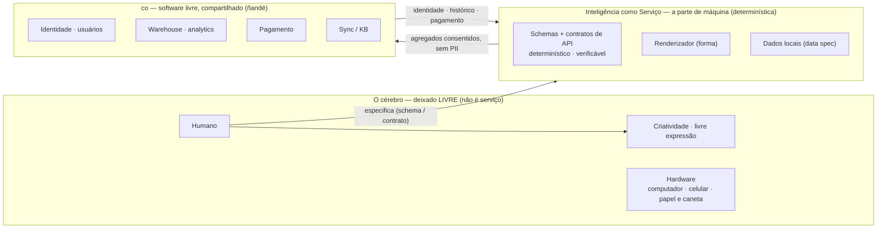
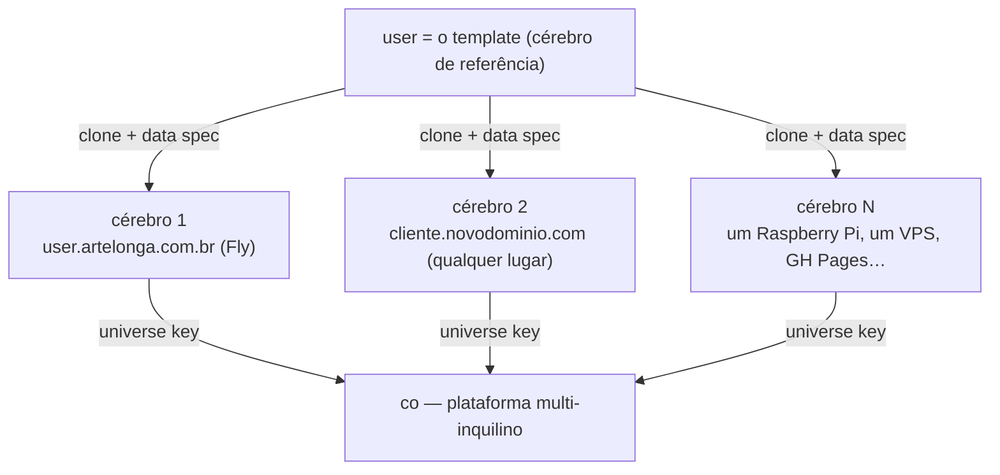
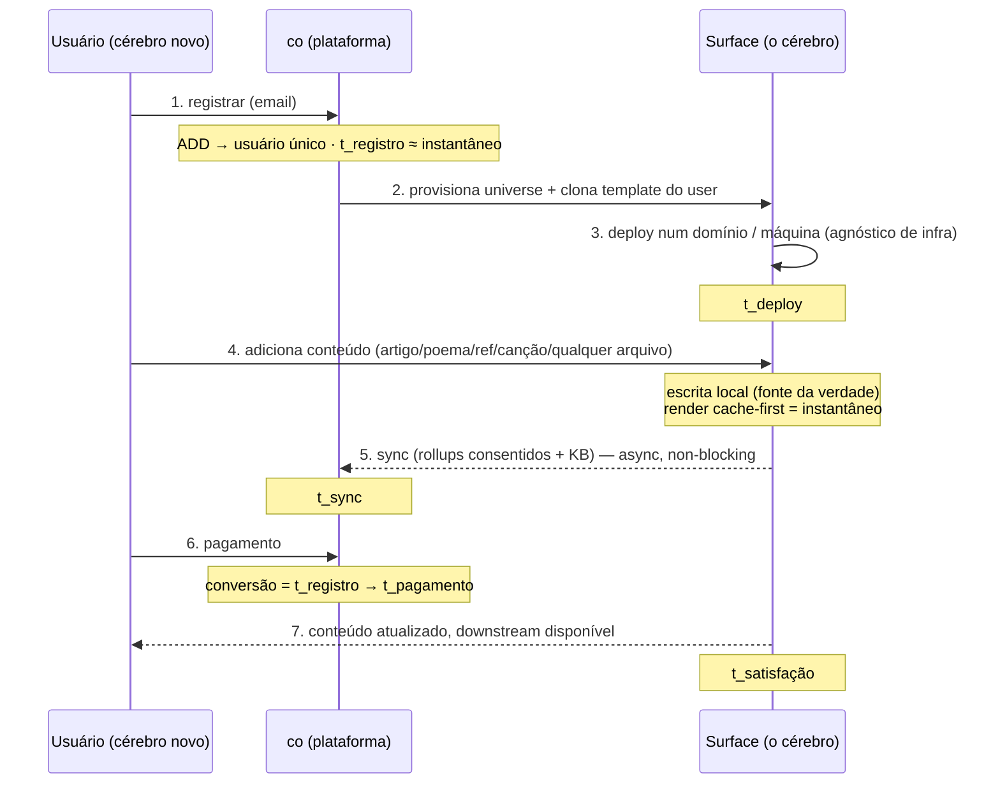
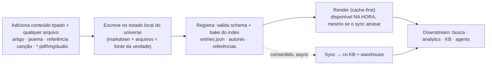
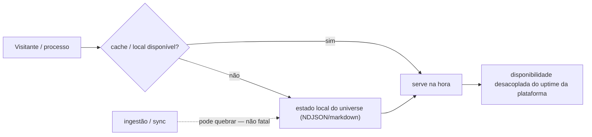
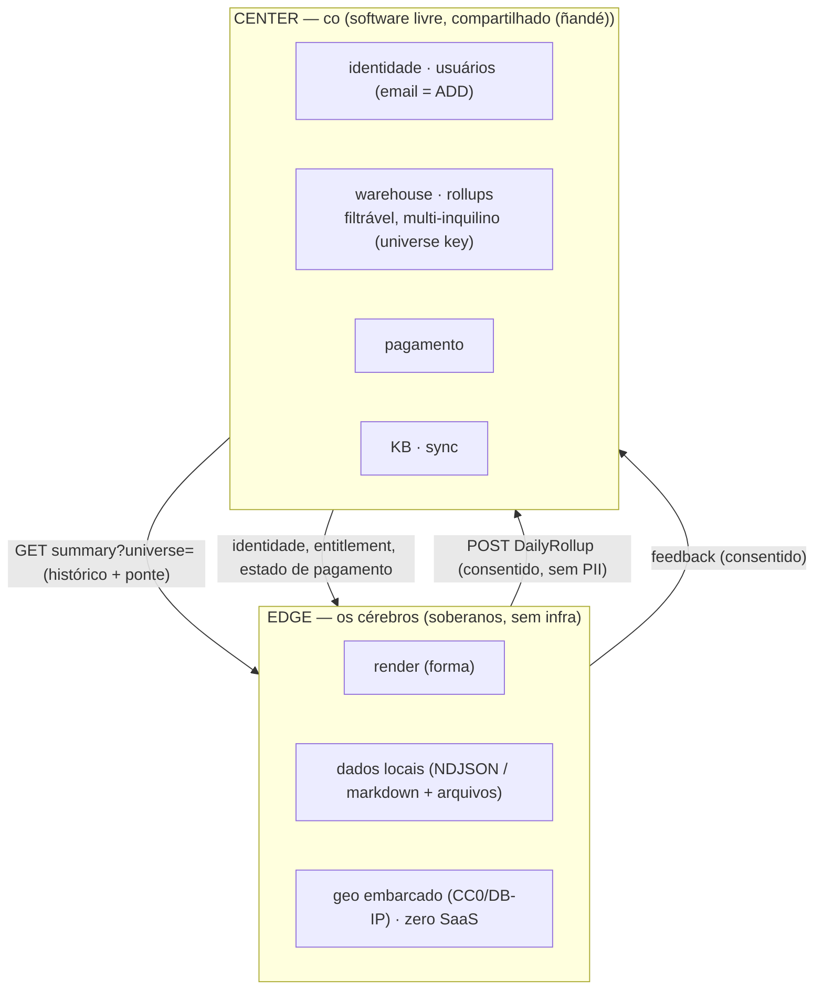

# Inteligência como Serviço (IaaS) — a linha entre o que é especificado e o que é criado

**Tese.** Existem duas inteligências, e a arquitetura traça a linha entre
elas honestamente. De um lado, a **inteligência de máquina** (determinística) — tudo o que um *schema* ou
um *contrato de API* consegue capturar: determinístico, funcional, verificável, reprodutível.
*Isso* é o que renderizamos **como serviço** — a inteligência "artificial", de máquina.
Do outro lado, o **cérebro** — a inteligência biológica, o humano — que
**deliberadamente excluímos da maquinaria determinística** e deixamos **livre para vagar**,
rumo à criatividade e à livre expressão. O serviço não transforma o cérebro em commodity; ele
absorve o trabalho determinístico *para que o cérebro seja libertado*. (Este é o próprio
tagline do user tornado literal: *escrevendo inteligência biológica e de máquina — pela livre
expressão do ser*.)

`user` é o caso de referência. `artelonga` é a **rede livre** — *ñandé*, "nós,
você incluído" (Guarani: *ñandé* = nós-com-você, não *oré* = nós-sem-você). **co é
software livre** que qualquer pessoa pode rodar. Este doc é o ensaio empírico + o playbook
de onboarding + o contrato de integração — fundamentado no que a surface do user já
comprova: [`telemetry-surfaces.md`](./telemetry-surfaces.md),
[`analytics-framework.md`](./analytics-framework.md),
[`universe-upgrade.md`](./universe-upgrade.md), `openapi/artelonga.yaml`.

---

## 0. O conceito em uma imagem

**Inteligência como Serviço** = a linha. O **cérebro permanece livre** (criatividade, livre
expressão); o **serviço é a inteligência de máquina (determinística) que *pode* ser especificada** —
schemas e contratos. **co** (software livre, *ñandé* — compartilhado) provê identidade,
memória (warehouse), metabolismo (payment) e sinapses (sync). O contrato é a
spec, nunca um dono.

---

## 1. O estudo de caso — o que `user` comprovou

| Building block que entregamos | O que comprova para IaaS |
|---|---|
| **Telemetria de propriedade do universe** + surface (`tools/surfaces-server.mjs`) | Um cérebro é dono dos seus dados crus; a plataforma é só broadcast. **Soberania.** |
| **Upgrade path → CNAME** (`universe-upgrade.md`) | Um cérebro promove de um path na mothership para o seu próprio domínio **sem perda de dados**. **Portabilidade.** |
| **Integração bidirecional** (push de rollups + leitura de volta do histórico) | Um cérebro alimenta a plataforma *e* reivindica de volta o próprio histórico. **Sem lock-in.** |
| **Geo embarcado** (CC0 + DB-IP, montado no deploy) | Insight completo nível GA **sem terceiros, sem SaaS, sem custo por chamada**. **Zero SaaS.** |
| **Identidade canônica de autor** (`neuro/authors.js`) | Uma identidade resolve todas as variantes de nome; o conteúdo é consultável por entidade. **Metadados unificados.** |
| **Separação form / content / data** | Rendering, dados e schema são camadas independentes. **Agnóstico de infra.** |

Cada um destes é uma *propriedade que um novo cérebro herda de graça* ao clonar o template
do user.

---

## 2. Por que escala horizontalmente a custo SaaS zero

Quatro invariantes arquiteturais tornam um cérebro uma unidade barata e independente:

1. **Três camadas separadas.** *Form* (renderer, CSS, JS) · *Content* (as entradas tipadas
   do cérebro + arquivos) · *Data spec* (schemas em `openapi/artelonga.yaml`). Um novo
   cérebro fornece **apenas uma especificação de dados, não infraestrutura de conteúdo** — o
   form e o server são o template compartilhado.
2. **Edge soberano.** Cada cérebro é dono do seu estado cru (NDJSON / markdown). A
   plataforma (co) guarda apenas **agregados consentidos e livres de PII** (`DailyRollup`). Sem
   store central de dados crus → custo linear, sem blast radius multi-tenant.
3. **Zero SaaS de terceiros.** A telemetria é self-hosted; o geo é um binário CC0/DB-IP
   embarcado, compilado no deploy; o analytics é o co (livre, self-hosted). **Sem Google Analytics, sem geo
   API, sem nada por assento.** O custo marginal do cérebro N ≈ o custo de uma pequena VM.
4. **Resiliência cache-first.** A surface renderiza a partir do estado local; se a **ingestão
   ou o sync quebrar, a entrega ainda funciona** (o apex faz fallback para uma fila em
   localStorage, a surface serve o seu NDJSON, o geo degrada para `null`). **A disponibilidade é
   desacoplada do uptime da plataforma.**

> **Liberdade de infra (hoje, literalmente verdade).** `user.artelonga.com.br` roda na Fly,
> mas a surface é um server Node de stdlib + arquivos estáticos + um DB embarcado. Pode rodar
> em outro domínio, em outra máquina, no GH Pages ou num laptop — **não estamos
> presos a nenhuma escolha de infra.** O único contrato é a **data spec**, não o host.

---

## 3. A especificação que um novo cliente fornece (dados, não conteúdo)

Um novo cérebro **não** traz infraestrutura. Ele traz uma **especificação de dados** —
que já existe, versionada, em `openapi/artelonga.yaml`:

| Camada | Schema (fonte da verdade) | Quem fornece |
|---|---|---|
| **Identity** | email → usuário único (um *ADD* ao user DB do co) | co |
| **Content entries** | tipadas: `article · poem · reference · song · file` (o shape de entrada do garden, `user/_schema.md`) | o cérebro |
| **References / authors** | registry `neuro/authors.js` + refs ABNT | o cérebro |
| **Telemetria / analytics** | `TelemetryEvent` (cru, edge) · `DailyRollup` (consentido, central) | ambos |
| **Payment / subscription** | billing do co | co |

O cérebro é dono do **content + render**; o co **provê** **identity + warehouse + payment +
sync**. Onboarding = conectar esses dois via a universe key.

---

## 4. Onboarding — o conjunto de passos de fato (checklist de revisão)

**Os 7 passos a revisar em cada onboarding** (cada um é um gate com um dono e um
KPI — ver §5):

1. **Register** — email → usuário único (`ADD` ao user DB do co). *Dono: co.*
2. **Provision** — cria o universe; clona o template do user (form + server).
   *Dono: co + tooling.*
3. **Deploy** — surface no ar em qualquer domínio/máquina; cert + DNS (o
   runbook `universe-upgrade.md` generaliza isso). *Dono: ops.*
4. **Ingest** — o cérebro adiciona conteúdo (qualquer tipo, qualquer arquivo); é registrado +
   validado por schema. *Dono: cérebro.*
5. **Sync** — agregados consentidos fluem para o co (warehouse + KB), bidirecionalmente.
   *Dono: surface ↔ co.*
6. **Convert** — payment. *Dono: co.*
7. **Satisfy** — conteúdo atualizado em todo lugar, downstream disponível. *Dono: o
   loop.*

Esta é a receita repetível: **clone o user, forneça a data spec, faça deploy em qualquer lugar,
conecte a universe key.**

---

## 5. KPIs & latência — tornando as interações instantâneas

A rede se importa com algumas métricas **time-to-X**; a arquitetura é desenhada para
colapsar cada uma rumo a zero.

| KPI | Definição | Alavanca que a torna rápida |
|---|---|---|
| **t_register** | email → usuário único | Um único `ADD`. Nenhum provisionamento bloqueia a identidade → **instantâneo**. |
| **t_deploy** | provision → surface no ar | Clona um template *estático*; o deploy é image-build + DNS → **minutos, agnóstico de infra**. |
| **t_register → t_payment** (conversão) | reg → pay | O payment vive no co ao lado da identidade; CTA na surface; sem redirect de SaaS → **reduz hops**. |
| **t_ingest → t_delivered** | adicionar conteúdo → disponível | **Cache-first**: a escrita local (fonte da verdade) renderiza imediatamente; o sync é async → **a entrega é instantânea mesmo se o sync atrasar**. |
| **t_sync** | local → KB/warehouse do co | Upsert idempotente (`DailyRollup`), com debounce, feature-detected → **non-blocking, eventualmente consistente**. |
| **t_satisfaction** | conteúdo correto em todo lugar | Cache-first + sync eventual + degradação graciosa → **quase instantâneo, resiliente**. |

**O truque recorrente (já no código):** *escrita local otimista + render cache-first
+ sync async consentido + upsert idempotente.* É exatamente o push de rollup
(cold-start + debounced, upsert por `(universe, day)`) e o feature-detect/localStorage-fallback
do dashboard apex. Generaliza-se: **toda interação é servida
a partir do cache mais próximo e reconciliada depois** — então a latência percebida pelo
usuário é o cache hit, não o round-trip.

---

## 6. Ingestão de conteúdo — "adicione qualquer coisa, está registrado, sincronizado, entregue"

> *"Posso adicionar um novo artigo / poema / referência / canção ou qualquer arquivo e garantir que está
> registrado, sincronizado, entregue à knowledge base e disponível downstream."*

Mapeado para as mecânicas reais que temos:
- **Write** = soltar uma entrada markdown tipada (`user/_schema.md`) + o arquivo no
  universe; é a fonte da verdade.
- **Register** = o passo de bake (`tools/bake-*.mjs`) valida por schema contra
  `openapi/artelonga.yaml` e reconstrói o index (`entries.json`, registry de autores,
  references) — *content separado do form*.
- **Render** = a surface o serve (cache `max-age=60`); **disponível antes do sync
  completar**.
- **Sync** = push consentido para o co (mesmo padrão do broadcast de rollup/feedback);
  entra no KB + warehouse, chaveado por universe.
- **Downstream** = consultável por entidade (a resolução de identidade de autor → "onde user
  é autor"), por analytics, por agents — *disponível para processos downstream*.

**Garantia de resiliência:** se o caminho de sync/ingestão quebrar, o cérebro ainda
**renderiza e serve** a partir do estado local — falha de ingestão ≠ indisponibilidade.

---

## 7. Integrando co + as surfaces — o contrato de onboarding

**O contrato é o schema, não a implementação** (`analytics-framework.md`).
Um cérebro integra ao:
- adotar a **universe key** (tenancy);
- emitir **`DailyRollup`s consentidos** (turnkey via o surfaces-server, ou um SDK
  para cérebros fora da Fly);
- ler de volta o seu **próprio histórico** a partir do summary `?universe=` do co;
- autenticar machine-to-machine com um **único token** (`CO_ROLLUP_TOKEN`).

Onboarding de um cliente = **(1)** adicionar o usuário (email) **(2)** emitir uma universe key
**(3)** clonar + deploy da surface **(4)** setar o token **(5)** apontar a data spec.
Nada mais é sob medida.

---

## 8. Revisão da sugestão — ela se sustenta?

| Afirmação no brief | Veredito | Evidência |
|---|---|---|
| Upgrade de telemetria (path → CNAME) | ✅ entregue + verificado no ar | `universe-upgrade.md`, a integração bidirecional |
| CNAME para escalabilidade horizontal | ✅ cada cérebro = domínio próprio | surfaces user/hostinger, server agnóstico de infra |
| Conversão (register → payment) | ◑ design + KPI definidos | identity + payment do co; §5 — falta o wiring do billing do co |
| Custo SaaS zero | ✅ verdade hoje | telemetria self-hosted + geo CC0/DB-IP, sem terceiros |
| Infra separada / livre de escolhas de infra | ✅ verdade hoje | server de stdlib + estático + data spec; roda em qualquer lugar |
| Spec de DB para dados (não conteúdo) | ✅ existe | schemas canônicos de `openapi/artelonga.yaml` |
| Render a partir do cache mesmo se a ingestão quebrar | ✅ entregue | cache-first + fallback de localStorage + geo gracioso |
| Adicionar qualquer conteúdo/arquivo tipado → sincronizado/entregue | ◑ parcial | bake + render entregues; sync completo do KB = o próximo build |

**Resumo:** o paradigma é real e majoritariamente comprovado no user. O trabalho restante é o
**wiring de conversão/payment** e o **sync content→KB** (o padrão de rollup
generaliza para ele). Ambos cabem nas costuras existentes; nenhum precisa de nova infra ou SaaS.

---

## 9. user como o template — a receita repetível

Para fazer onboarding do cérebro N:

1. **`add-user(email)`** → co (instantâneo, um ADD).
2. **`mint-universe(handle)`** → tenancy key.
3. **`clone-surface(user)`** → form + server de stdlib + slots de data-spec.
4. **`deploy(any-host)`** → cert + DNS (runbook `universe-upgrade.md`).
5. **`set CO_ROLLUP_TOKEN` + `CO_HISTORY`** → integração bidirecional ligada.
6. **`supply data spec`** → o cérebro preenche o conteúdo; o bake o registra.
7. **Revise os 7 gates de onboarding (§4) contra os KPIs (§5).**

`user` não é um caso especial — é o **template de fato** de como a artelonga escala
para N cérebros, cada um soberano, cada um na infra que for mais barata, cada um custando ~uma
VM pequena, integrados a uma plataforma livre que todos nós compartilhamos (ñandé).
Veja [o modelo /user](./user-template.html).

---

## Referências

- [`telemetry-surfaces.md`](./telemetry-surfaces.md) — surfaces, Option C, geo, paridade com GA.
- [`analytics-framework.md`](./analytics-framework.md) — schema canônico, API central filtrável, producers.
- [`universe-upgrade.md`](./universe-upgrade.md) — o runbook path→CNAME (generaliza para o deploy de onboarding).
- `openapi/artelonga.yaml` — a data spec (o contrato que um cérebro fornece).
