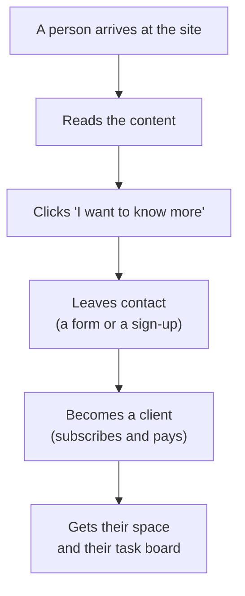

# Lead acquisition — the E2E funnel (review)

The end-to-end lead-acquisition journey as wired today, step by step from the user's
side, with what observes each step and where the gaps are. Feeds the Scrum delivery
([`scrum-retrospective.md`](./scrum-retrospective.md)) and the BaaS onboarding
([`brain-as-a-service.md`](./brain-as-a-service.md)).

## Step by step (grounded in the real machinery)

| # | Step | User does | Wired | Observed by |
|---|---|---|---|---|
| 1 | **Discover** | arrives (search / referral / social / direct) | apex + surfaces (user, neuro, /scrum) | `acquisition` = utm_source → referrer → "(direto)" |
| 2 | **Engage** | browses garden, bibliography, portfolio | content = top-of-funnel; cache-first | `page_view` · `scroll_depth` · `page_end`/dwell · device · geo |
| 3 | **Intent** | clicks "Para parceiros" (`/faca-parte/`), feedback, outbound | CTAs → `/faca-parte/` · `/parceiros/` · "Fale Conosco" | `click_cta` · `goal` (conversions) |
| 4a | **Capture — lead form** | submits contact/interest | **`POST /api/v1/leads`** → status `new`, admin notified (CO-183) | the lead queue |
| 4b | **Capture — signup** | email → magic code → verify | `al-signup.js` → **`POST co/api/v1/auth/onboard-with-email`** → `…/verify` | `signup_request` → `signup_verify_success`/`_failed` |
| 5 | **Qualify** | (admin) | state machine **`new → triaged → in_progress → closed`** (priority + reason won/lost/spam/duplicate) | `/admin/leads.html` |
| 6 | **Register** | becomes unique user | email = **ADD to user DB** (t_register ≈ instant) | the verify event |
| 7 | **Convert** | subscribes / pays | subscription (assinatura) + payment | conversion = t_register → t_payment |
| 8 | **Onboard** | becomes partner/brain | universe + **provision the scrum Kanban board** (co tasks) | bidirectional rollups |

## Review — solid vs. gaps

**Solid:** steps 1–4 are wired and **fully observable** (acquisition, engagement, intent
goals, both capture endpoints). co has a real **lead pipeline** (intake → queue → triage)
and a real **identity** flow (email magic-code).

**Three gaps:**

1. **Two capture paths aren't unified** — `POST /api/v1/leads` (sales queue) and the
   `auth/onboard-with-email` signup are separate; a signup isn't auto-a-lead. They
   should join on **email** (one identity), so the funnel is attributable end-to-end.
2. **No single funnel report** — the pieces are measured in *different stores*
   (acquisition/conversions in analytics; leads/auth in co). Nothing stitches
   `source → goal → signup → lead → payment` into one funnel with per-step drop-off.
   This is the killer use of the analytics warehouse (`?breakdown=` over the rollups;
   see [`analytics-framework.md`](./analytics-framework.md)).
3. **Convert/payment is unproven** — steps 1–6 are real; step 7 (payment) is the
   partial gap in `brain-as-a-service.md`.

## KPIs the funnel should expose (none require new infra)

`t_landing` (instant, cache-first) · intent rate (`click_cta`/`page_view`) · capture rate
(`signup_request`/`click_cta`) · verify rate · **t_register** (instant) · **conversion**
(t_register → t_payment) · qualify SLA (`new`→`triaged`).

## The highest-leverage fix

**Unify capture so a signup *is* a lead** (email join key, one identity). That turns the
funnel from "measurable in pieces" into "one attributable funnel" — and it's the join
that lets the convert step provision the Scrum board (step 8).
