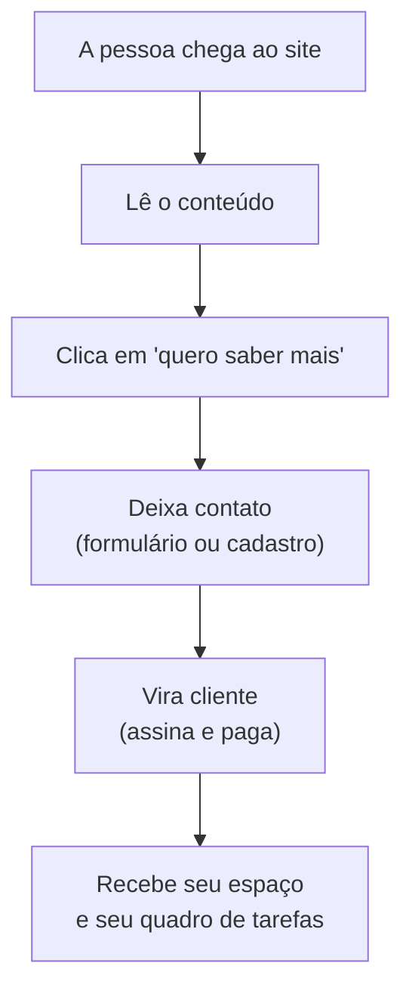

# Aquisição de leads — o funil E2E (revisão)

A jornada end-to-end de aquisição de leads como está conectada hoje, passo a passo
do lado do usuário, com o que observa cada passo e onde estão os gaps. Alimenta a
entrega Scrum ([`scrum-retrospective.md`](./scrum-retrospective.md)) e o onboarding
BaaS ([`brain-as-a-service.md`](./brain-as-a-service.md)).

## Passo a passo (ancorado na maquinaria real)

| # | Passo | Usuário faz | Conectado | Observado por |
|---|---|---|---|---|
| 1 | **Discover** | chega (search / referral / social / direto) | apex + surfaces (user, neuro, /scrum) | `acquisition` = utm_source → referrer → "(direto)" |
| 2 | **Engage** | navega pelo jardim, bibliografia, portfólio | content = topo de funil; cache-first | `page_view` · `scroll_depth` · `page_end`/dwell · device · geo |
| 3 | **Intent** | clica em "Para parceiros" (`/faca-parte/`), feedback, outbound | CTAs → `/faca-parte/` · `/parceiros/` · "Fale Conosco" | `click_cta` · `goal` (conversions) |
| 4a | **Capture — lead form** | envia contato/interesse | **`POST /api/v1/leads`** → status `new`, admin notificado (CO-183) | a fila de leads |
| 4b | **Capture — signup** | email → magic code → verify | `al-signup.js` → **`POST co/api/v1/auth/onboard-with-email`** → `…/verify` | `signup_request` → `signup_verify_success`/`_failed` |
| 5 | **Qualify** | (admin) | state machine **`new → triaged → in_progress → closed`** (priority + reason won/lost/spam/duplicate) | `/admin/leads.html` |
| 6 | **Register** | torna-se usuário único | email = **ADD ao user DB** (t_register ≈ instantâneo) | o evento de verify |
| 7 | **Convert** | assina / paga | assinatura (subscription) + payment | conversion = t_register → t_payment |
| 8 | **Onboard** | torna-se parceiro/brain | universe + **provisiona o board Kanban scrum** (co tasks) | rollups bidirecionais |

## Revisão — sólido vs. gaps

**Sólido:** os passos 1–4 estão conectados e **totalmente observáveis** (acquisition,
engagement, intent goals, ambos os endpoints de capture). co tem um **lead pipeline**
real (intake → queue → triage) e um fluxo de **identidade** real (email magic-code).

**Três gaps:**

1. **Os dois caminhos de capture não estão unificados** — `POST /api/v1/leads` (sales
   queue) e o signup `auth/onboard-with-email` são separados; um signup não vira lead
   automaticamente. Eles deveriam se juntar pelo **email** (uma identidade), para que o
   funil seja atribuível end-to-end.
2. **Não há um único report de funil** — as peças são medidas em *stores diferentes*
   (acquisition/conversions em analytics; leads/auth em co). Nada costura
   `source → goal → signup → lead → payment` em um funil único com drop-off por passo.
   Esse é o uso matador do analytics warehouse (`?breakdown=` sobre os rollups;
   ver [`analytics-framework.md`](./analytics-framework.md)).
3. **Convert/payment não está comprovado** — os passos 1–6 são reais; o passo 7
   (payment) é o gap parcial em `brain-as-a-service.md`.

## KPIs que o funil deveria expor (nenhum exige nova infra)

`t_landing` (instantâneo, cache-first) · intent rate (`click_cta`/`page_view`) · capture
rate (`signup_request`/`click_cta`) · verify rate · **t_register** (instantâneo) ·
**conversion** (t_register → t_payment) · qualify SLA (`new`→`triaged`).

## O fix de maior alavancagem

**Unificar o capture para que um signup *seja* um lead** (email como join key, uma
identidade). Isso transforma o funil de "mensurável em pedaços" para "um funil
atribuível" — e é o join que permite ao passo convert provisionar o board Scrum
(passo 8).
