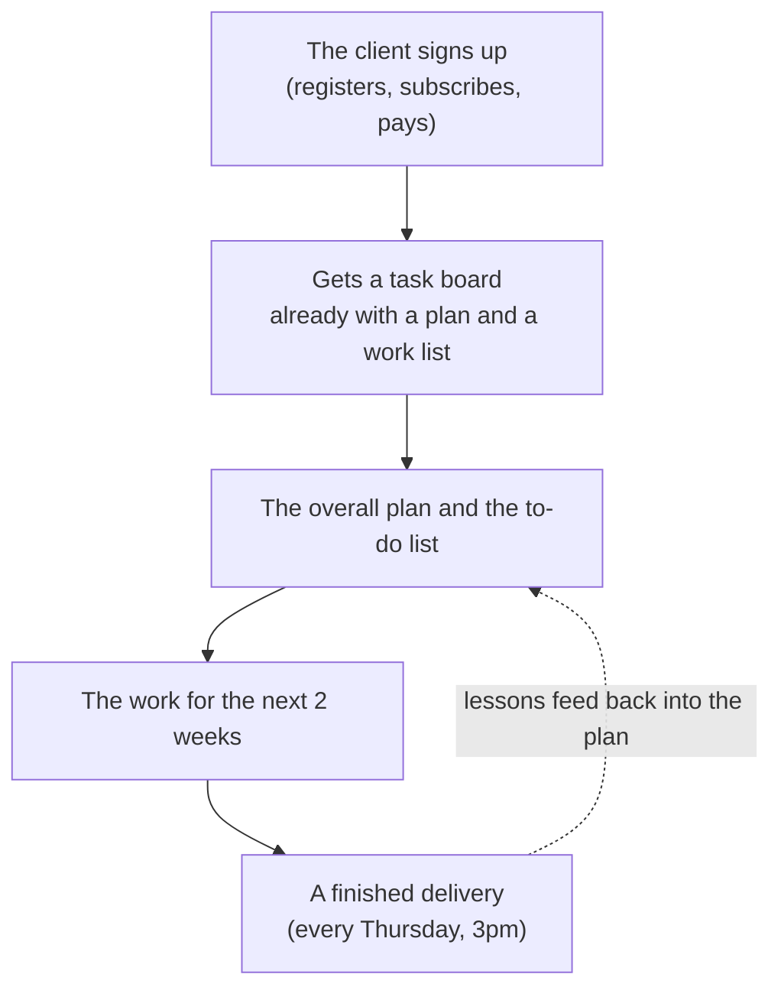
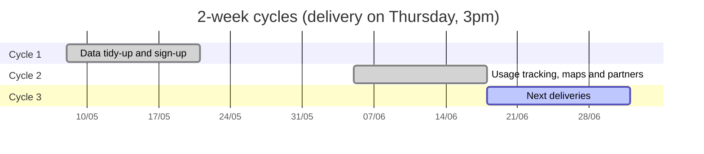
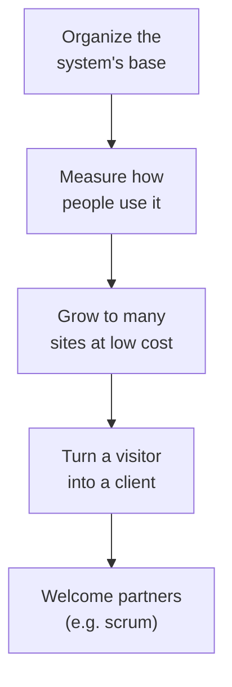

# Scrum in co — from funnel to kanban delivery (retrospective + materials)

How **lead acquisition → conversion** culminates in the **delivery of a Kanban** (co
board) governed by **Scrum principles**, with the materials (roles, roadmap, product/sprint
backlog, Definition of Done) rendered as **co tasks** — and a **retrospective**
that simulates the real releases as biweekly sprints (Thursday, 3pm BRT).

> **Basis.** "The delivered requirements" = the `CHANGELOG.md` + the commit history (the
> real record). If the pasted material has additional requirements, I integrate them here.

---

## 1. From funnel to kanban delivery

Conversion (the last step of the funnel — see [`lead-acquisition`](./lead-acquisition.md))
**triggers the provisioning of the partner's Scrum board** in co:



**Delivered in a timely manner** = at the moment of conversion, the partner already receives a
board with roadmap + backlog seeded (not an empty workspace). This is the "timely
kanban according to Scrum principles".

---

## 2. Roles (Scrum Team) — mapped onto co

| Scrum Role | Who | Does | co |
|---|---|---|---|
| **Product Owner** | ArteLonga member / the partner (lead) | defines **roadmap** + **product backlog**, prioritizes, accepts the DoD | identity (owner) + tasks |
| **Developers** | co-auto + members | define the **sprint backlog**, create the **Increment** | tasks + commits/PR |
| **Scrum Master** | the process (this doc) | ensures the cadence + ceremonies | calendar + board |

PO and Devs **define the product roadmap, the product backlog and the sprint backlog** — all
**rendered as co tasks** (the `createTask/updateTask/getDashboard/...` API).

---

## 3. Cadence — biweekly releases (Thursday, 3pm BRT)

- **Sprint = 2 weeks**; **release on Thursday, 3pm BRT** (= the Increment).
- **Cutoff:** a feature merged **after** Thursday 3pm **goes into the next release**.
- **Release calendar (biweekly Thursdays):**

| Release (Thu 15h BRT) | Sprint | Version | Theme |
|---|---|---|---|
| **2026-05-21** | Phase C | `0.14.0` | modular data, TS runtime, OpenAPI, signup |
| **2026-06-04** | (groundwork) | `0.13.x` | telemetry/identity base |
| **2026-06-18** | Observability & BaaS | `0.15.0`–`0.20.0` | telemetry, geo, analytics framework, BaaS, author identity, scrum |
| **2026-07-02** | (next) | — | features merged after 06-18 3pm |

> Example of the cutoff rule: the work for `0.15.0`–`0.20.0` was merged on
> **Fri 2026-06-05**, *after* the Thu **2026-06-04 3pm** release → it goes into the
> **2026-06-18** Thursday release.



---

## 4. Materials (draft) — rendered as co tasks

### Product Roadmap (PO)



### Product Backlog → co tasks

The backlog already exists as `work/artelonga/AL-N.md` (43 items). Each item becomes a **co
task**. Shape (the `createTask` API):

```json
{ "title": "AL-56 — OpenAPI como source of truth + gen-types",
  "status": "done", "sprint": "Phase C", "owner": "user",
  "dod": ["tsc --noEmit OK", "validate-yaml OK", "tipos regenerados"],
  "release": "0.14.0", "delivered": "2026-05-21" }
```

### Sprint Backlog (of the current sprint) → co tasks

A subset of the product backlog committed to in the sprint, moved across the board columns
(`backlog → todo → doing → done`).

---

## 5. Retrospective — the real releases as sprints (with DoD)

Each **delivered requirement** (from the CHANGELOG) as a co task, with the **Definition of Done
that was met**:

### Sprint "Observability & BaaS" — release 2026-06-18 (`0.15.0`–`0.20.0`)

| Requirement (co task) | Version | Definition of Done met |
|---|---|---|
| Observability parity across surfaces + apex chart | `0.15.0` | local smoke · deploy user+hostinger · **verified live** · changelog |
| Geo IPv6 + acquisition (UTM) + device | `0.16.0` | tests · deploy · **live (IPv4+IPv6)** |
| City geo (DB-IP) | `0.17.0` | compiled bin · deploy · **live (Taboão da Serra, BR)** |
| Build-time geo bins (not content) | `0.17.1` | reproducible deploy (no local state) |
| Analytics framework — canonical schema | `0.18.0` | openapi + types · **typecheck + validate-yaml OK** |
| Bidirectional rollup integration (push + read-back) | `0.19.0` | tested local+live · **co PR #152** |
| Unified author identity (neuro=base, user=UI) | `0.20.0` | **12 green tests** · neuro deploy · live |
| Scrum (partner) — folder + references | — | draft (noindex) · **green CI** |

### Sprint "Phase C" — release 2026-05-21 (`0.14.0`)

| Requirement (co task) | AL | Definition of Done met |
|---|---|---|
| Modular data layer (`assets/data.js` → 6 modules) | AL-53/54 | per-page bundles · audits OK |
| TS runtime + OpenAPI codegen | AL-55/56 | `tsc --noEmit` · `gen-types` · pre-commit drift gate |
| Signup/auth bridge (email magic-code) | AL-50..52/57..60 | `/entrar/` flow · co integration |

---

## 6. Definition of Done — the standard (what "done" means here)

The de-facto DoD of this project (met in each item above):

- [ ] **Green:** syntax-check + tests + `npm run audit` + `typecheck` (Rust: `cargo test` + `clippy -D warnings` + `fmt`).
- [ ] **Delivered:** deploy + **verified live** (not just "it compiles").
- [ ] **Traceable:** conventional commit + entry in `CHANGELOG.md` (the "why").
- [ ] **Documented:** doc/runbook when the fix teaches something (e.g. `docs/*`).
- [ ] **Green CI** on the PR (the `quality` gate).

The **calendar** (§3) carries, per release, **which requirements** shipped and **with which
DoD** — exactly the "calendar with the definitions of done of the delivered requirements".

---

## 7. Gaps (honest retrospective)

- **Conversion → automatic board** (§1) is design; the trigger in co is missing (creating the board
  on conversion). Tasks/board already exist in co (`tasks.js`); the *provisioning* is missing.
- **Payment** (step 7 of the funnel) is still pending (see `brain-as-a-service.md`).
- **Sprints as data in co** — this retrospective is markdown; the next step is to
  seed it as real co tasks (the API exists) so it becomes the living board.

## References

- [**/scrum/** (partner)](/scrum/) — the Scrum framework (roles, events, artifacts) + official guide. *Scrum is a partner; this doc is ArteLonga's delivery, and links to it.*
- [`lead-acquisition`](./lead-acquisition.md) — the funnel up to conversion.
- [`brain-as-a-service`](./brain-as-a-service.md) — onboarding + KPIs.
- `work/artelonga/AL-N.md` — the existing product backlog (43 items).
- `CHANGELOG.md` — the delivered requirements (the basis of the retrospective).
