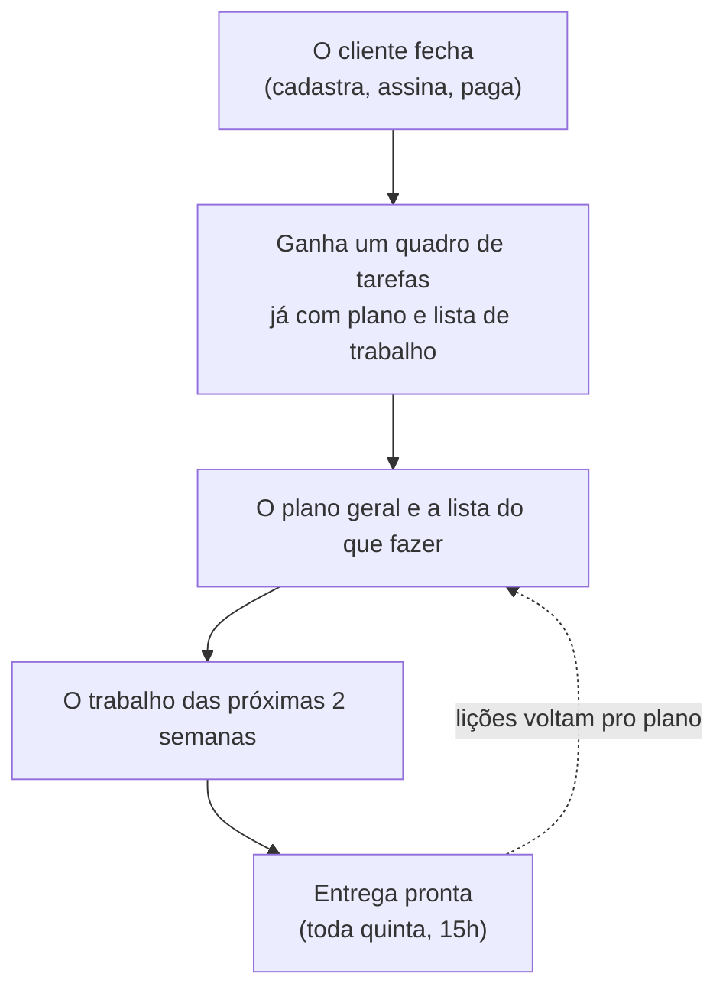
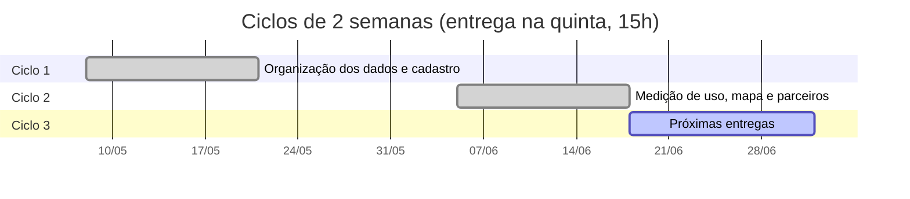
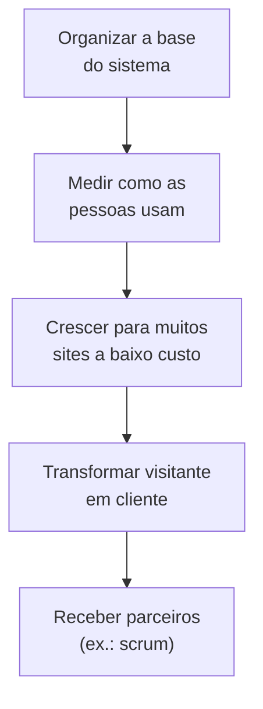

# Scrum no co — do funil à entrega do kanban (retrospectiva + materiais)

Como a **aquisição de lead → conversão** culmina na **entrega de um Kanban** (board
co) regido por **princípios Scrum**, com os materiais (papéis, roadmap, product/sprint
backlog, Definition of Done) renderizados como **co tasks** — e uma **retrospectiva**
que simula os releases reais como sprints quinzenais (quinta-feira, 15h BRT).

> **Base.** "Os requisitos entregues" = o `CHANGELOG.md` + o histórico de commits (o
> registro real). Se o material colado tiver requisitos adicionais, integro-os aqui.

---

## 1. Do funil à entrega do kanban

A conversão (último passo do funil — ver [`lead-acquisition`](./lead-acquisition.md))
**dispara o provisionamento do board Scrum** do parceiro no co:



**Entregue de forma tempestiva** = no momento da conversão, o parceiro já recebe um
board com roadmap + backlog semeados (não um workspace vazio). Isso é o "kanban
tempestivo segundo princípios Scrum".

---

## 2. Papéis (Scrum Team) — mapeados no co

| Papel Scrum | Quem | Faz | co |
|---|---|---|---|
| **Product Owner** | membro ArteLonga / o parceiro (lead) | define **roadmap** + **product backlog**, prioriza, aceita o DoD | identity (owner) + tasks |
| **Developers** | co-auto + membros | definem **sprint backlog**, criam o **Increment** | tasks + commits/PR |
| **Scrum Master** | o processo (este doc) | garante a cadência + cerimônias | calendário + board |

PO e Devs **definem o product roadmap, o product backlog e o sprint backlog** — todos
**renderizados como co tasks** (a API `createTask/updateTask/getDashboard/...`).

---

## 3. Cadência — releases quinzenais (quinta, 15h BRT)

- **Sprint = 2 semanas**; **release na quinta, 15h BRT** (= o Increment).
- **Cutoff:** feature mergeada **depois** da quinta 15h **entra no próximo release**.
- **Calendário de releases (quintas quinzenais):**

| Release (Thu 15h BRT) | Sprint | Versão | Tema |
|---|---|---|---|
| **2026-05-21** | Phase C | `0.14.0` | data modular, runtime TS, OpenAPI, signup |
| **2026-06-04** | (groundwork) | `0.13.x` | base telemetria/identidade |
| **2026-06-18** | Observabilidade & BaaS | `0.15.0`–`0.20.0` | telemetria, geo, analytics framework, BaaS, identidade de autores, scrum |
| **2026-07-02** | (próximo) | — | features mergeadas após 06-18 15h |

> Exemplo da regra de cutoff: o trabalho de `0.15.0`–`0.20.0` foi mergeado em
> **sex 2026-06-05**, *depois* do release de qui **2026-06-04 15h** → entra no release
> de qui **2026-06-18**.



---

## 4. Materiais (draft) — renderizados como co tasks

### Product Roadmap (PO)



### Product Backlog → co tasks

O backlog já existe como `work/artelonga/AL-N.md` (43 itens). Cada item vira uma **co
task**. Shape (a API `createTask`):

```json
{ "title": "AL-56 — OpenAPI como source of truth + gen-types",
  "status": "done", "sprint": "Phase C", "owner": "user",
  "dod": ["tsc --noEmit OK", "validate-yaml OK", "tipos regenerados"],
  "release": "0.14.0", "delivered": "2026-05-21" }
```

### Sprint Backlog (da sprint corrente) → co tasks

Subconjunto do product backlog comprometido na sprint, movido pelas colunas do board
(`backlog → todo → doing → done`).

---

## 5. Retrospectiva — os releases reais como sprints (com DoD)

Cada **requisito entregue** (do CHANGELOG) como uma co task, com a **Definition of Done
que foi cumprida**:

### Sprint "Observabilidade & BaaS" — release 2026-06-18 (`0.15.0`–`0.20.0`)

| Requisito (co task) | Versão | Definition of Done cumprida |
|---|---|---|
| Paridade de observabilidade nas surfaces + gráfico apex | `0.15.0` | smoke local · deploy user+hostinger · **verificado live** · changelog |
| Geo IPv6 + aquisição (UTM) + dispositivo | `0.16.0` | testes · deploy · **live (IPv4+IPv6)** |
| Geo de cidade (DB-IP) | `0.17.0` | bin compilado · deploy · **live (Taboão da Serra, BR)** |
| Geo bins build-time (não content) | `0.17.1` | deploy reproduzível (sem estado local) |
| Analytics framework — schema canônico | `0.18.0` | openapi + types · **typecheck + validate-yaml OK** |
| Integração bidirecional rollup (push + read-back) | `0.19.0` | testado local+live · **co PR #152** |
| Identidade unificada de autores (neuro=base, user=UI) | `0.20.0` | **12 testes verdes** · deploy neuro · live |
| Scrum (parceiro) — pasta + referências | — | draft (noindex) · **CI verde** |

### Sprint "Phase C" — release 2026-05-21 (`0.14.0`)

| Requisito (co task) | AL | Definition of Done cumprida |
|---|---|---|
| Data layer modular (`assets/data.js` → 6 módulos) | AL-53/54 | bundles por página · audits OK |
| Runtime TS + OpenAPI codegen | AL-55/56 | `tsc --noEmit` · `gen-types` · pre-commit drift gate |
| Signup/auth bridge (email magic-code) | AL-50..52/57..60 | fluxo `/entrar/` · integração co |

---

## 6. Definition of Done — o padrão (o que "pronto" significa aqui)

A DoD de-facto deste projeto (cumprida em cada item acima):

- [ ] **Verde:** syntax-check + testes + `npm run audit` + `typecheck` (Rust: `cargo test` + `clippy -D warnings` + `fmt`).
- [ ] **Entregue:** deploy + **verificado live** (não só "compila").
- [ ] **Rastreável:** commit convencional + entrada no `CHANGELOG.md` (o "porquê").
- [ ] **Documentado:** doc/runbook quando o fix ensina algo (ex. `docs/*`).
- [ ] **CI verde** na PR (o gate `quality`).

O **calendário** (§3) carrega, por release, **quais requisitos** saíram e **com qual
DoD** — exatamente o "calendário com as definitions of done dos requisitos entregues".

---

## 7. Lacunas (retrospectiva honesta)

- **Conversão → board automático** (§1) é design; falta o gatilho no co (criar o board
  na conversão). Tarefas/board já existem no co (`tasks.js`); falta o *provisioning*.
- **Pagamento** (passo 7 do funil) segue pendente (ver `brain-as-a-service.md`).
- **Sprints como dado no co** — esta retrospectiva é markdown; o passo seguinte é
  semeá-la como co tasks reais (a API existe) pra virar o board vivo.

## Referências

- [**/scrum/** (parceiro)](/scrum/) — o framework Scrum (papéis, eventos, artefatos) + guia oficial. *Scrum é um parceiro; esta doc é a entrega da ArteLonga, e linka pra ele.*
- [`lead-acquisition`](./lead-acquisition.md) — o funil até a conversão.
- [`brain-as-a-service`](./brain-as-a-service.md) — onboarding + KPIs.
- `work/artelonga/AL-N.md` — o product backlog existente (43 itens).
- `CHANGELOG.md` — os requisitos entregues (a base da retrospectiva).
