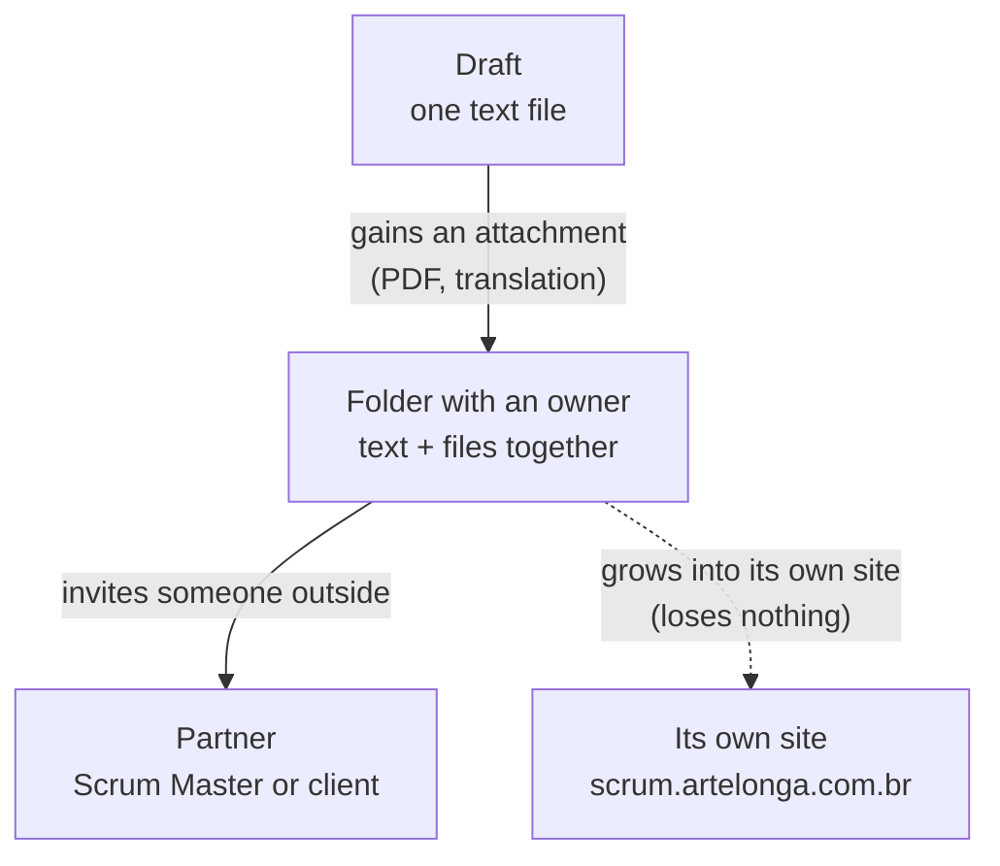
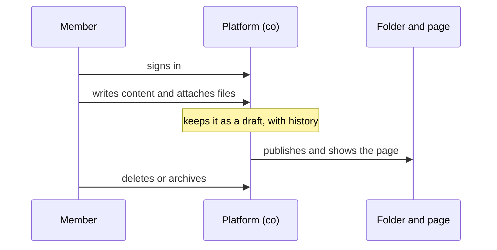
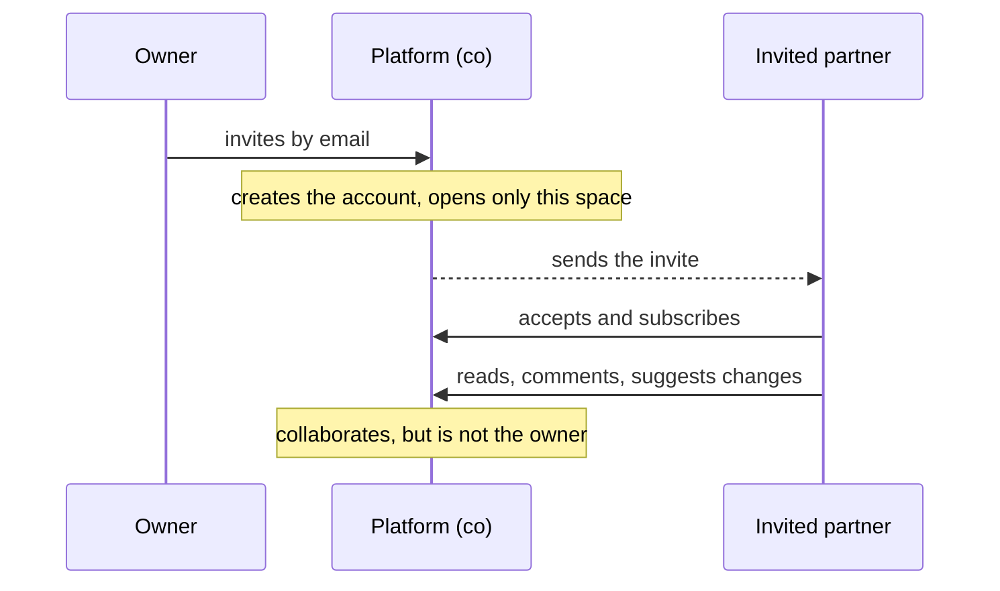
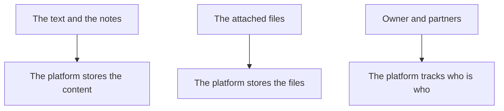

# Scrum — folder → published page → (upgradeable) surface

A working instance of the **Brain-as-a-Service** pattern
([`brain-as-a-service.md`](./brain-as-a-service.md)) and the content lifecycle
**draft → folder (lead) → partner**. This doc reviews the technical requirements,
business needs, and co compatibility for the two user experiences: an **ArteLonga
member CRUD-ing scrum content**, and a **scrum partner invited into the universe**.

## 0. What was created

```
scrum/
├── scrum.md                 # the content (draft) — lead: user
├── 2020-Scrum-Guide-US.pdf  # the attachment (why it's a folder)
└── index.html               # the form — publishes at artelonga.com.br/scrum
```

**Status: rascunho (`draft: true`).** A pasta existe e é renderizável em
`artelonga.com.br/scrum`, mas é **`noindex`** e marcada como rascunho — visível só
pra revisão do lead, **ainda não publicada**. `index.html` renderiza `scrum.md`
client-side e cai num stub baked se o fetch falhar — **forma separada de conteúdo,
renderiza no cache mesmo se a ingestão quebrar**. Publicar = sair do estágio draft
(`draft: false`, remover `noindex`).

## 1. Why a *folder* (and the lifecycle)



- A **`.md` can't hold binaries** (the Scrum Guide PDF, a pt-BR translation).
- A **folder** groups *content + attachments + future entries* into one **portable
  unit** — the same unit you later promote to its own surface.
- The folder carries a **lead** (owner) and can admit **partners** (collaborators).
  That's the `draft → folder(lead) → partner` lifecycle, and it's exactly the
  granularity the [universe-upgrade](./universe-upgrade.md) runbook promotes.

## 2. Publishing now → upgrading later (infra-agnostic, zero SaaS)

| Stage | Where | Gate |
|---|---|---|
| **Draft (now)** | `/scrum` — **`noindex`** | `draft: true` · revisão do lead, não público |
| **Published** | `artelonga.com.br/scrum` (público, indexado) | `draft: false` · sai do rascunho |
| **Surface** | `scrum.artelonga.com.br` | `universe-upgrade.md` runbook — own domain/machine, no data loss |

The folder is the migration unit. Going draft→published is a **frontmatter gate**;
promotion to a surface changes the **host**, never the content or the data spec.

## 3. The two user experiences

### A) ArteLonga **member** — CRUD scrum content



**Requirements (member CRUD):**

| Need | Today (static) | With co | co primitive |
|---|---|---|---|
| Identity / auth | — (git) | member login | users / auth |
| Create/Read/Update/Delete entries | edit `.md` + commit | content API | `/api/v1/universes/{slug}/entries` |
| Attachments (any file type) | drop file in folder | upload to storage | object storage (R2) |
| Drafts / versioning | git history | entry history + inline proposals | entries/history, proposals |
| Publish / sync | bake + push | reindex + deliver | `/reindex`, sync |
| Visibility (public/private) | public | per-entry | público / privado |

### B) Scrum **partner** — invited into the universe



**Requirements (partner invite):**

| Need | With co | co primitive |
|---|---|---|
| Invite by email | email → user ADD | identity |
| Scoped access (read/collaborate, not own) | role on the universe | members / collaborators |
| Subscription / follow | assinatura | subscription |
| Collaboration (comments, edit proposals) | inline proposals + feedback | proposals, feedback |
| Notification | invite + activity | notifications |
| Tenancy isolation (partner sees only this universe) | universe key | multi-tenant universes |

## 4. Compatibility & extensibility with co

The scrum folder maps **1:1** onto co primitives that already exist — no new
platform concepts:



- **Contract = the schema, not the implementation** ([`analytics-framework.md`](./analytics-framework.md)).
  The folder supplies a **data spec**; co supplies identity, CRUD, storage,
  subscription, payment, analytics.
- **Extensible**: scrum is universe *N* among many — the same path any partner topic
  takes. Onboarding a new content folder = the 7 steps in
  [`brain-as-a-service.md §4`](./brain-as-a-service.md).
- **Telemetry** comes free: once on a surface, the bidirectional rollup integration
  (push + read-back) gives scrum its own analytics, bridged to the parent.

## 5. Business needs

- **Offering** — Scrum as a packaged practice/service ArteLonga sells; the public
  `/scrum` page is the top-of-funnel.
- **Partner onboarding** — invite an external Scrum Master or a client into a shared,
  scoped workspace (registration → subscription → collaboration → payment).
- **Zero SaaS, own infra** — no third-party PM tool; the folder + co cover content,
  files, identity, billing.
- **KPIs** (per [`brain-as-a-service.md §5`](./brain-as-a-service.md)):
  *t_publish* (edit → live, cache-first ≈ instant), *t_invite* (invite → partner
  active), *t_freshness* (new attachment/entry → synced + delivered).

## 6. Technical requirements — summary checklist

- [ ] **Now (shipped):** folder + draft + attachment + public page, content/form
      separated, graceful fallback. ✅
- [ ] **Member CRUD:** co auth + entries API + object storage + draft/publish.
- [ ] **Partner invite:** email-ADD + scoped role + subscription + proposals/feedback.
- [ ] **Upgrade to `scrum.artelonga.com.br`:** the `universe-upgrade.md` runbook
      (DNS/cert/deploy/telemetry) — when the folder warrants its own surface.
- [ ] **Analytics:** inherit the bidirectional rollup integration on upgrade.

## References

- [`brain-as-a-service.md`](./brain-as-a-service.md) — the paradigm, onboarding steps, KPIs.
- [`universe-upgrade.md`](./universe-upgrade.md) — folder → CNAME surface runbook.
- [`analytics-framework.md`](./analytics-framework.md) — the multi-tenant contract.
- `scrum/scrum.md` — the content (draft, lead: user).
