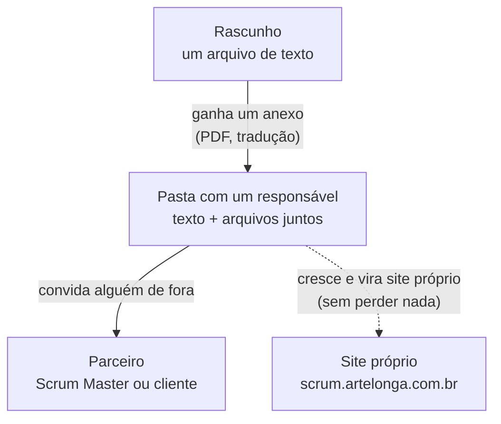
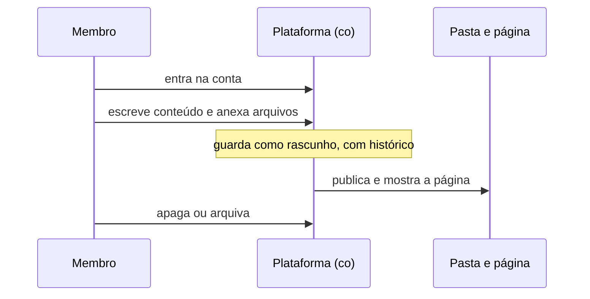
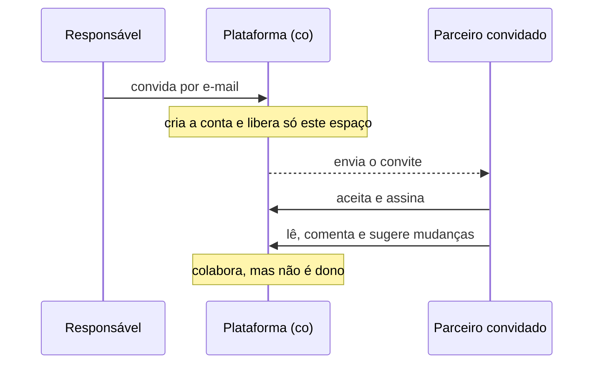
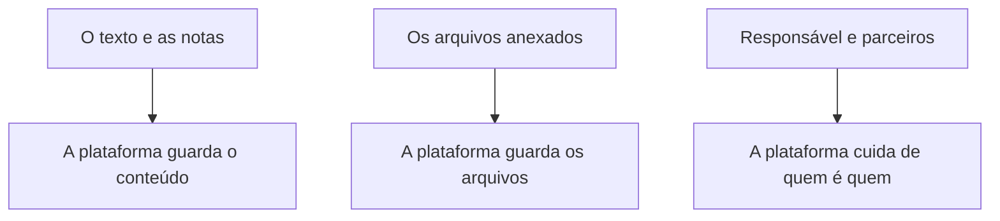

# Scrum — pasta → página publicada → surface (upgradeable)

Uma instância funcional do padrão **Brain-as-a-Service**
([`brain-as-a-service.md`](./brain-as-a-service.md)) e do ciclo de vida de conteúdo
**draft → pasta (lead) → partner**. Este doc revisa os requisitos técnicos,
necessidades de negócio e compatibilidade com co para as duas experiências de usuário: um **membro
da ArteLonga fazendo CRUD de conteúdo scrum**, e um **partner de scrum convidado para o universe**.

## 0. O que foi criado

```
scrum/
├── scrum.md                 # the content (draft) — lead: user
├── 2020-Scrum-Guide-US.pdf  # the attachment (why it's a folder)
└── index.html               # the form — publishes at artelonga.com.br/scrum
```

**Status: rascunho (`draft: true`).** A pasta existe e é renderizável em
`artelonga.com.br/scrum`, mas é **`noindex`** e marcada como rascunho — visível só
pra revisão do lead, **ainda não publicada**. `index.html` renderiza `scrum.md`
client-side e cai num stub baked se o fetch falhar — **forma separada de conteúdo,
renderiza no cache mesmo se a ingestão quebrar**. Publicar = sair do estágio draft
(`draft: false`, remover `noindex`).

## 1. Por que uma *pasta* (e o ciclo de vida)



- Um **`.md` não pode guardar binários** (o PDF do Scrum Guide, uma tradução pt-BR).
- Uma **pasta** agrupa *conteúdo + attachments + entradas futuras* em uma só **unidade
  portátil** — a mesma unidade que você depois promove para sua própria surface.
- A pasta carrega um **lead** (owner) e pode admitir **partners** (collaborators).
  Esse é o ciclo de vida `draft → pasta(lead) → partner`, e é exatamente a
  granularidade que o runbook [universe-upgrade](./universe-upgrade.md) promove.

## 2. Publicar agora → fazer upgrade depois (infra-agnostic, zero SaaS)

| Estágio | Onde | Gate |
|---|---|---|
| **Draft (agora)** | `/scrum` — **`noindex`** | `draft: true` · revisão do lead, não público |
| **Publicado** | `artelonga.com.br/scrum` (público, indexado) | `draft: false` · sai do rascunho |
| **Surface** | `scrum.artelonga.com.br` | runbook `universe-upgrade.md` — domínio/máquina próprios, sem perda de dados |

A pasta é a unidade de migração. Ir de draft→publicado é um **gate de frontmatter**;
a promoção para uma surface muda o **host**, nunca o conteúdo ou a data spec.

## 3. As duas experiências de usuário

### A) **Membro** ArteLonga — CRUD de conteúdo scrum



**Requisitos (CRUD do membro):**

| Necessidade | Hoje (static) | Com co | Primitiva co |
|---|---|---|---|
| Identidade / auth | — (git) | login do membro | users / auth |
| Create/Read/Update/Delete de entries | editar `.md` + commit | content API | `/api/v1/universes/{slug}/entries` |
| Attachments (qualquer tipo de arquivo) | jogar arquivo na pasta | upload para storage | object storage (R2) |
| Drafts / versionamento | git history | history de entry + propostas inline | entries/history, proposals |
| Publish / sync | bake + push | reindex + deliver | `/reindex`, sync |
| Visibilidade (público/privado) | público | por entry | público / privado |

### B) **Partner** de scrum — convidado para o universe



**Requisitos (convite de partner):**

| Necessidade | Com co | Primitiva co |
|---|---|---|
| Convidar por email | email → ADD de user | identity |
| Acesso scoped (ler/colaborar, não possuir) | role no universe | members / collaborators |
| Subscription / follow | assinatura | subscription |
| Colaboração (comentários, propostas de edição) | propostas inline + feedback | proposals, feedback |
| Notificação | convite + atividade | notifications |
| Isolamento de tenancy (partner vê só este universe) | universe key | multi-tenant universes |

## 4. Compatibilidade & extensibilidade com co

A pasta scrum mapeia **1:1** sobre primitivas co que já existem — sem novos
conceitos de plataforma:



- **Contrato = o schema, não a implementação** ([`analytics-framework.md`](./analytics-framework.md)).
  A pasta fornece uma **data spec**; co fornece identity, CRUD, storage,
  subscription, payment, analytics.
- **Extensível**: scrum é o universe *N* entre muitos — o mesmo caminho que qualquer tópico
  de partner percorre. Onboarding de uma nova pasta de conteúdo = os 7 passos em
  [`brain-as-a-service.md §4`](./brain-as-a-service.md).
- **Telemetry** vem de graça: uma vez numa surface, a integração bidirecional de rollup
  (push + read-back) dá ao scrum sua própria analytics, conectada ao parent.

## 5. Necessidades de negócio

- **Oferta** — Scrum como uma prática/serviço empacotado que a ArteLonga vende; a página
  pública `/scrum` é o topo de funil.
- **Onboarding de partner** — convidar um Scrum Master externo ou um cliente para um workspace
  compartilhado e scoped (registro → subscription → colaboração → payment).
- **Zero SaaS, infra própria** — sem ferramenta de PM de terceiros; a pasta + co cobrem conteúdo,
  arquivos, identity, billing.
- **KPIs** (conforme [`brain-as-a-service.md §5`](./brain-as-a-service.md)):
  *t_publish* (edição → no ar, cache-first ≈ instantâneo), *t_invite* (convite → partner
  ativo), *t_freshness* (novo attachment/entry → synced + delivered).

## 6. Requisitos técnicos — checklist resumido

- [ ] **Agora (entregue):** pasta + draft + attachment + página pública, conteúdo/forma
      separados, fallback graceful. ✅
- [ ] **CRUD do membro:** auth co + entries API + object storage + draft/publish.
- [ ] **Convite de partner:** ADD por email + role scoped + subscription + proposals/feedback.
- [ ] **Upgrade para `scrum.artelonga.com.br`:** o runbook `universe-upgrade.md`
      (DNS/cert/deploy/telemetry) — quando a pasta merecer sua própria surface.
- [ ] **Analytics:** herdar a integração bidirecional de rollup no upgrade.

## Referências

- [`brain-as-a-service.md`](./brain-as-a-service.md) — o paradigma, passos de onboarding, KPIs.
- [`universe-upgrade.md`](./universe-upgrade.md) — runbook pasta → surface CNAME.
- [`analytics-framework.md`](./analytics-framework.md) — o contrato multi-tenant.
- `scrum/scrum.md` — o conteúdo (draft, lead: user).
